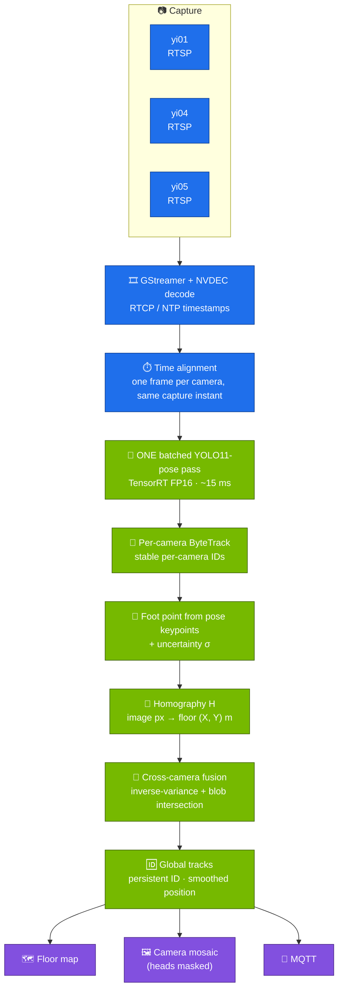
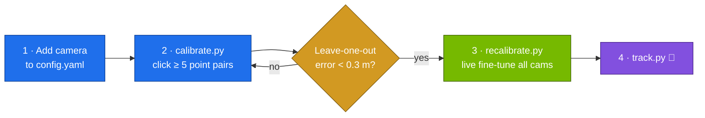
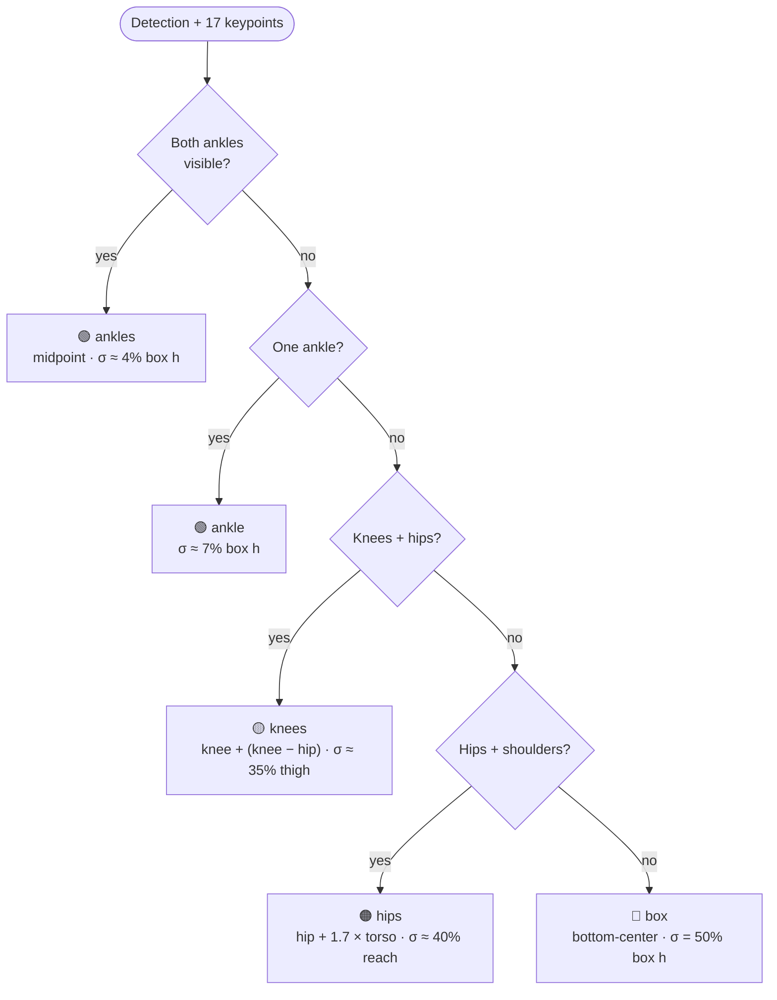
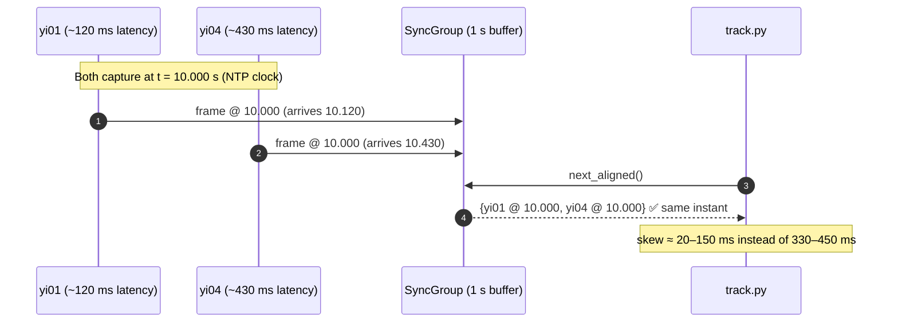
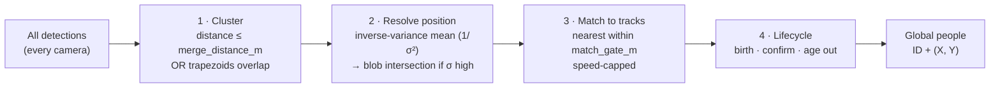
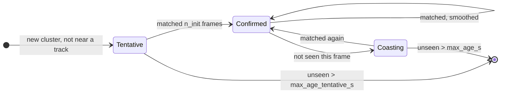

<div align="center">

# 🛰️ Real-time 3D Occupancy

### Multi-camera people tracking in real-world floor coordinates

**Ordinary RGB IP cameras → one shared top-down map → persistent IDs and (X, Y) positions in meters, live.**


-brightgreen)

[How it works](#-how-it-works) ·
[Quick start](#-quick-start) ·
[Calibration](#-calibration) ·
[Running](#-running-the-tracker) ·
[Configuration](#%EF%B8%8F-configuration-reference) ·
[Deep dives](#-deep-dives) ·
[Troubleshooting](#-troubleshooting)

</div>

---

## 📖 Table of contents

1. [Overview](#-overview)
2. [How it works](#-how-it-works)
3. [Quick start](#-quick-start)
4. [The world frame](#%EF%B8%8F-the-world-frame)
5. [Calibration](#-calibration)
6. [Running the tracker](#-running-the-tracker)
7. [MQTT output](#-mqtt-output)
8. [Configuration reference](#%EF%B8%8F-configuration-reference)
9. [Deep dives](#-deep-dives)
   - [Foot-point estimation from pose](#1-foot-point-estimation-from-pose)
   - [NTP time-alignment](#2-ntp-time-alignment--why-one-person-isnt-two)
   - [Ground-plane blob intersection](#3-ground-plane-blob-intersection--the-other-half)
   - [Cross-camera fusion & track lifecycle](#4-cross-camera-fusion--track-lifecycle)
   - [Privacy masking](#5-privacy-masking)
10. [Performance](#-performance-on-jetson-agx-thor)
11. [Accuracy & limitations](#-accuracy--limitations)
12. [Repository layout](#-repository-layout)
13. [Tools & tests](#-tools--tests)
14. [Troubleshooting](#-troubleshooting)
15. [Roadmap & further docs](#%EF%B8%8F-roadmap--further-docs)

---

## 🔭 Overview

A single camera can't measure depth — but **people stand on a flat floor**, so
their feet lie on the ground plane. A one-time **homography** per camera maps
floor pixels to meters on **one shared top-down map**. Combining several cameras
then gives robust, occlusion-tolerant positions for everyone in the room.

<table>
<tr>
<td width="50%" valign="top">

**What you get**

- 🆔 A **persistent global ID** per person, across all cameras
- 📍 **(X, Y) position in meters** on the lab map
- 🗺️ Live **floor map** + **camera mosaic** windows
- 📡 **MQTT** position stream (with trails and speed)
- 🙈 **Privacy**: heads masked in every preview

</td>
<td width="50%" valign="top">

**What makes it robust**

- ⏱️ **NTP-synced capture** — all cameras aligned to the same instant
- 🦵 **Pose-based feet** — survives desks and occluded legs
- 🔷 **Blob intersection** — cameras that can't see the feet still agree
- 🧮 **Inverse-variance fusion** — confident views dominate
- 🚀 **One batched TensorRT pass** for all cameras (~15 ms)

</td>
</tr>
</table>

---

## 🧠 How it works



Each loop step, in plain words:

| # | Stage | What happens | Code |
|:-:|-------|--------------|------|
| 1 | **Capture** | Every camera is decoded on the Jetson's NVDEC; each frame carries a capture timestamp on a clock shared by all cameras. | `tracker3d/gst_stream.py` |
| 2 | **Align** | A 1 s buffer per camera lets the loop pick frames that were all captured at the **same instant**. | `tracker3d/sync.py` |
| 3 | **Detect** | All camera frames go through **one** batched YOLO11-pose TensorRT call. | `tracker3d/detector.py` |
| 4 | **Track** | ByteTrack keeps IDs stable within each camera. | `tracker3d/detector.py`, `bytetrack.yaml` |
| 5 | **Locate** | The feet are estimated from pose keypoints (with an uncertainty), then projected through the camera's homography to meters. | `tracker3d/geometry.py`, `tracker3d/localize.py` |
| 6 | **Fuse** | Detections of the same person from different cameras are merged into one global track. | `tracker3d/fusion.py`, `tracker3d/groundblob.py` |
| 7 | **Output** | Floor map, camera mosaic with masked heads, and MQTT messages. | `tracker3d/render.py`, `tracker3d/privacy.py`, `tracker3d/mqtt_output.py` |

---

## 🚀 Quick start

> [!NOTE]
> Target hardware is an **NVIDIA Jetson AGX Thor** (JetPack R39). Other CUDA
> machines work too; set `sync.decoder: sw` if there's no NVDEC.

```bash
# 1 — install (venv, CUDA PyTorch, deps, GStreamer link, TensorRT engine)
cd ~/people_tracker_3d
./setup.sh
source .venv/bin/activate

# 2 — (optional) MQTT credentials
cp .env.example .env        # fill in MQTT_USERNAME / MQTT_PASSWORD

# 3 — calibrate each camera once (see "Calibration")
python calibrate.py --camera yi01

# 4 — track!
python track.py
```

<details>
<summary><b>What <code>setup.sh</code> does</b></summary>

1. Creates `.venv` and installs **PyTorch with CUDA 13** from the official `cu130` index.
2. Installs `requirements.txt` (Ultralytics, OpenCV, laspy, paho-mqtt, …).
3. Links the **system PyGObject + GStreamer** into the venv (no working pip wheel on Jetson).
   If missing, it prints the `apt install` line to run.
4. Verifies `torch.cuda.is_available()`.
5. Builds the **TensorRT FP16 engine** `yolo11m-pose.engine` (a few minutes, once).

</details>

<details>
<summary><b>Rebuilding the TensorRT engine</b></summary>

Rebuild after upgrading Ultralytics/TensorRT, or after changing
`detector.imgsz` / `detector.max_batch`:

```bash
python tools/export_engine.py            # uses config.yaml values
python tools/export_engine.py --batch 4 --imgsz 640
```

If the engine is missing, `track.py` falls back to the `.pt` weights (≈ 3× slower).

</details>

> [!TIP]
> For best performance run the board in MAXN:
> `sudo nvpmodel -m 0 && sudo jetson_clocks`, and keep other CPU-heavy services
> off the Thor.

---

## 🗺️ The world frame

Every camera calibrates into **one shared top-down map**, rendered from the lab
point-cloud scan `data/smart_lab.las` (projected straight down, in true scan
colour — or shaded by height with `color_mode: height`).

```
      Y (m)
      ▲
      │   ┌───────────────────────────────┐
      │   │  lab point-cloud, top-down    │
      │   │                               │
      │   │        ● P1 (3.2, 2.1)        │
      │   │                  ● P2         │
      │   │                               │
      │   └───────────────────────────────┘
      └──────────────────────────────────────▶ X (m)
    origin = min corner of the scan footprint
```

- **Units:** meters. **Origin:** the scan footprint's min corner.
- **Valid area:** `floorplan.valid_area: auto` derives a room mask from the scan,
  so detections that project outside the room are dropped before fusion.

Preview the map (and warm its render cache):

```bash
python tools/topdown.py --show                # writes topdown.png
python tools/topdown.py --mode height --show  # colour by height
```

> [!WARNING]
> `flip_x`, `flip_y`, `clip_percentile` and `up_axis` **move the frame itself**.
> Change any of them and **every camera must be recalibrated**.

---

## 🎯 Calibration

Calibration is done **once per camera placement**. It finds the homography that
maps the camera's floor pixels to the map's meters.



### Step 1 — Configure the cameras

In `config.yaml → cameras:` add one entry per camera:

```yaml
cameras:
  - name: yi01
    source: "rtsp://192.168.50.72/ch0_0.h264"   # or "usb:0" or "/path/video.mp4"
    homography_file: "calib/yi01_homography.npy"
```

### Step 2 — Click point pairs

```bash
python calibrate.py --camera yi01
python calibrate.py --camera yi01 --frame saved.jpg   # use a saved image instead
```

Two windows open — the **camera** and the **map**:

| Action | How |
|--------|-----|
| Freeze a camera frame | <kbd>SPACE</kbd> |
| Add a pair | click a point on the **map**, then the **same physical spot** in the camera |
| Reuse a shared point | click a **gray** reference point (created by another camera) |
| Undo last pair | <kbd>U</kbd> |
| Finish & save | <kbd>ENTER</kbd> (needs ≥ 4 pairs) |
| Quit without saving | <kbd>Q</kbd> |

**Good calibration points:** ≥ 5, well spread across the floor — room corners,
bench corners, floor tape marks. Include **shared points** in the overlap with
other cameras so their calibrations agree.

On save you get `calib/<name>_homography.npy` plus a `.json` sidecar (image size +
clicked points), and two error numbers:

| Metric | Meaning | Target |
|--------|---------|--------|
| *Fit error* | error on the clicked points themselves (always ≈ 0 with exactly 4 points — meaningless) | — |
| **Leave-one-out error** | how far a **new** floor point will land (needs ≥ 5 points) | **< 0.3 m** |

> [!NOTE]
> The sidecar records the image size, so a stream delivered at a different
> resolution is **rescaled automatically** instead of silently mis-projecting.

### Step 3 — Live fine-tuning

```bash
python recalibrate.py
```

Stand in view of the cameras. Each camera projects **you** onto the map in real
time; drag points until your dot lands on your true spot **and** the cameras agree
(the map shows `yi01<->yi04: 0.42 m apart` — green below 0.7 m).

| Control | Effect |
|---------|--------|
| Left-drag a **camera** point | moves it for that camera only |
| Left-drag a **map** point | moves the shared reference for every camera using it |
| Right-click a point | deletes it |
| <kbd>S</kbd> / <kbd>R</kbd> / <kbd>Q</kbd> | save / reload from disk / quit |

---

## ▶️ Running the tracker

```bash
python track.py                         # GUI: "floor map" + "cameras" windows, q quits
python track.py --headless 60           # no GUI for 60 s, snapshots every second
python track.py --headless 60 --save-dir ~/snaps
python track.py --config other.yaml
```

| Mode | Windows | Snapshots | Stops with |
|------|---------|-----------|------------|
| GUI (default) | `floor map`, `cameras` | — | <kbd>Q</kbd> |
| `output.show_window: false` | none | — | <kbd>Ctrl</kbd>+<kbd>C</kbd> / `SIGTERM` |
| `--headless N` | none | `floor_map.png`, `cameras.png` every 1 s | after *N* s |

Every second the console prints a status line and a sync-health line:

```text
 24.8 FPS | detect 15.2 ms | draw  3.1 ms | 2 people P1(3.2,2.1), P4(5.8,1.0)
[sync] spread=  38ms | yi01 lag= 121ms ntp=30/30 | yi04 lag= 142ms ntp=30/30 | yi05 lag= 159ms ntp=30/30
```

| Field | Meaning |
|-------|---------|
| `FPS` | processed loop steps per second |
| `detect` / `draw` | ms per step in detection+localization / rendering |
| `P<id>(x,y)` | global track ID and its position in meters |
| `spread` | capture-time spread across cameras in the aligned set (lower is better) |
| `lag` | how far each camera trails real time |
| `ntp=a/b` | frames with a valid NTP timestamp / total |
| `rc=N` · `STUCK` | watchdog reconnects so far · camera currently wedged |

---

## 📡 MQTT output

Enable under `output.mqtt` and put credentials in `.env`:

```yaml
output:
  mqtt:
    enabled: true
    broker: "192.168.50.117"
    port: 1883
    serial: "051003342"
    topic: "smx/device/051003342/position"
    publish_hz: 10       # max publish rate
    trail_length: 10     # last N positions per person
```

Positions are published as TAC-B-style `position` messages. `X` / `Y` are in
**centimeters**, newest first; `speed` is in m/s:

```json
{
  "messageType": "position",
  "collector_serial": "051003342",
  "total_detected_objects": 1,
  "target_count": 0,
  "object_list": {
    "4": {
      "ID": "4",
      "X": [582.1, 578.4, 574.9],
      "Y": [101.3, 102.0, 102.6],
      "speed": 0.41,
      "object_type": "pedestrian"
    }
  }
}
```

The client reconnects automatically (1–30 s back-off) and clears its speed
history on reconnect, so there's no bogus speed spike after an outage.

---

## ⚙️ Configuration reference

All settings live in [`config.yaml`](config.yaml) (commented in detail) and
tracker thresholds in [`bytetrack.yaml`](bytetrack.yaml).

<details>
<summary><b><code>detector</code> — model & inference</b></summary>

| Key | Default | Description |
|-----|---------|-------------|
| `model` | `yolo11m-pose.engine` | TensorRT engine (falls back to `.pt`) |
| `conf` | `0.15` | **Keep low** — filters boxes *before* ByteTrack; the real gating is in `bytetrack.yaml` |
| `iou` | `0.5` | NMS IoU |
| `imgsz` | `640` | Input size (must match the engine) |
| `device` | `cuda:0` | `cuda:0` or `cpu` |
| `half` | `true` | FP16 for `.pt` weights (engine precision is fixed at export) |
| `max_batch` | `4` | All cameras run as one batch (must match the engine) |
| `kp_conf` | `0.5` | Min keypoint visibility to trust an ankle/hip/etc. |

</details>

<details>
<summary><b><code>floorplan</code> — the world map</b></summary>

| Key | Default | Description |
|-----|---------|-------------|
| `pointcloud_file` | `data/smart_lab.las` | Lab scan |
| `px_per_m` | `50` | Map canvas resolution |
| `margin_m` | `0.5` | Blank border |
| `up_axis` | `auto` | Vertical axis of the scan ⚠️ |
| `color_mode` | `rgb` | `rgb` or `height` |
| `ceiling_trim_m` | `0.4` | Drop the top of the scan so the ceiling doesn't hide the floor |
| `clip_percentile` | `0.2` | Trim stray points on the footprint edges ⚠️ |
| `flip_x` / `flip_y` | `true` / `false` | Mirror the map ⚠️ |
| `reference_points_file` | `data/reference_points.json` | Shared calibration points |
| `valid_area` | `auto` | Room mask; or explicit corners `[[x,y], …]`; `[]` disables |

⚠️ = moves the world frame → recalibrate every camera.

</details>

<details>
<summary><b><code>sync</code> — NTP-aligned capture</b></summary>

| Key | Default | Description |
|-----|---------|-------------|
| `enabled` | `true` | Align all cameras to a common capture instant (RTSP only) |
| `decoder` | `hw` | `hw` = Jetson NVDEC · `sw` = openh264 · `nvdec` = nvh264dec |
| `tol_ms` | `75` | A frame must be within this of the target instant |
| `buffer_sec` | `1.0` | Per-camera frame history |
| `latency_ms` | `100` | RTSP jitter buffer |
| `protocol` | `udp` | `udp` keeps latency live; `tcp` only if udp won't connect |
| `drop_on_latency` | `true` | Drop late buffers instead of growing latency |
| `retransmission` | `false` | RTP retransmission (fewer artifacts, more latency) |
| `lag_budget_ms` | `500` | Drop a camera lagging more than this behind the most-live one |
| `reconnect_stuck_ms` | `3000` | Watchdog: reconnect if no frame for this long |
| `reconnect_lag_ms` | `2000` | Watchdog: reconnect on sustained lag (0 = off) |

</details>

<details>
<summary><b><code>fusion</code> — cross-camera merge & track lifecycle</b></summary>

| Key | Default | Description |
|-----|---------|-------------|
| `merge_distance_m` | `1.6` | Detections this close across cameras = same person |
| `match_gate_m` | `1.8` | Max movement between frames to keep an ID |
| `max_age_s` | `1.5` | Keep an unseen track this long (occlusion) |
| `smoothing` | `0.35` | Position EMA (higher = snappier) |
| `blob_min_sigma_m` | `0.15` | Use blob intersection only when fused σ exceeds this |
| `conf_drop_ratio` | `0.5` | Drop members below this fraction of the cluster's best confidence |
| `n_init` | `3` | Frames a new track must survive before it's shown |
| `max_age_tentative_s` | `0.4` | Unconfirmed tracks age out this fast |
| `dup_suppress_m` | `1.0` | No new track within this distance of an existing one |
| `max_speed_mps` | `2.5` | Speed cap (a bad frame can't drag a marker across the room) |
| `use_blob` | `true` | Ground-plane blob intersection |
| `blob_far_frac` / `blob_near_frac` | `0.1` / `1.4` | Trapezoid reach past / toward the camera (× box height) |
| `blob_clip_inflate` | `2.5` | Reach for boxes clipped at the frame bottom |
| `blob_body_aspect` | `3.0` | Expected h:w of a standing body |
| `blob_short_aspect` | `1.8` | Below this h:w the box is torso-only |
| `blob_merge_gate_m` | `3.0` | Looser merge gate for overlapping trapezoids |
| `show_raw_dots` / `show_blobs` | `true` / `false` | Debug drawing |

</details>

<details>
<summary><b><code>output</code> — windows, privacy, MQTT</b></summary>

| Key | Default | Description |
|-----|---------|-------------|
| `show_window` | `true` | `false` = no GUI |
| `show_camera_windows` | `true` | Show the camera mosaic |
| `preview_width` | `640` | Tile width (drawing happens at this size) |
| `privacy.enabled` | `true` | Mask heads in previews/snapshots |
| `privacy.method` | `pixelate` | `pixelate` · `blur` · `solid` |
| `privacy.scale` | `1.3` | Grow the head ellipse |
| `privacy.kp_thresh` | `0.3` | Min head-keypoint confidence |
| `mqtt.*` | — | See [MQTT output](#-mqtt-output) |

</details>

<details>
<summary><b><code>bytetrack.yaml</code> — per-camera tracker</b></summary>

| Key | Value | Why |
|-----|-------|-----|
| `track_high_thresh` | `0.35` | First-stage match threshold |
| `track_low_thresh` | `0.1` | Second-stage recovery keeps tracks through confidence dips |
| `new_track_thresh` | `0.4` | Min score to start a track |
| `track_buffer` | `50` | Processed frames to keep a lost track (~2.5 s at ~20 FPS) |
| `match_thresh` | `0.8` | Association threshold |
| `fuse_score` | **`False`** | Must stay `False`, otherwise the low-score recovery stage never matches |

</details>

---

## 🔬 Deep dives

### 1. Foot-point estimation from pose

The box bottom is only the feet when the feet are visible. The pose model gives
17 COCO keypoints, so the tracker walks down a **fallback ladder** and attaches
an uncertainty **σ** that grows with how much it had to guess:



The foot point goes through the homography to meters, and σ goes along with it —
so fusion knows an occluded, extrapolated foot is **much less trustworthy** than
a visible ankle, even if the detector was confident about the box.

### 2. NTP time-alignment — why one person isn't two

Cameras have different end-to-end latency (measured here: ~120 ms on one camera,
~430 ms on two others). Fusing *whatever each camera last sent* compares a moving
person at **different moments** — and if those positions differ by more than
`merge_distance_m`, you get **two dots for one person**.

**Fix:** the cameras are **chrony/NTP clients of the Jetson**, so every frame
carries an RTCP capture timestamp on a shared clock. The tracker buffers a second
of frames per camera and lines them up to a **common capture instant**.



- Needs **RTSP/H.264** sources and system **PyGObject + GStreamer** (`setup.sh` links them).
- `protocol: udp` keeps latency *live*: over `tcp`, packet loss makes the jitter
  buffer ratchet up and never drain, so one camera slowly drifts ~1 s behind.
- A camera lagging more than `lag_budget_ms` is **dropped from the aligned set**
  rather than dragging every camera back to its time.
- A **per-camera watchdog** reconnects a stuck or lagging stream while the others
  keep running.
- Check the live skew: `python tools/check_sync.py --seconds 8`.

### 3. Ground-plane blob intersection — the other half

Sync fixes duplicates caused by **lag**. Duplicates caused by a camera that
**can't see the feet** (desk, frame edge) need geometry: the box bottom sits
*above* the real feet, so that camera places the person **too far away**.

With `fusion.use_blob: true`, each detection's box is projected to a **floor
trapezoid** of possible foot positions, and the person is placed where the
cameras' trapezoids **overlap**:

```
   camera that SEES the feet              camera that CAN'T (occluded / clipped)
   ─────────────────────────              ──────────────────────────────────────
   short trapezoid at the feet            long trapezoid reaching toward the camera
                                          "the feet are somewhere in here"
              ╲   ╱                                 ╲         ╱
               ╲ ╱        ◀── intersection ──▶       ╲       ╱
                ▀           collapses onto the         ╲     ╱
                            true foot position           ╲ ╱
```

- Occlusion only ever makes the foot look *too far*, so the trapezoid reaches
  mostly **toward the camera** (`blob_near_frac`), barely past the box (`blob_far_frac`).
- **Clipped** boxes (touching the frame bottom) reach further (`blob_clip_inflate`).
- **Torso-only** boxes (h:w below `blob_short_aspect`) reach further still.
- Two detections merge when their trapezoids overlap, up to `blob_merge_gate_m`.
- Non-overlapping trapezoids (e.g. calibration error) fall back to the point
  mean — it never makes things worse.
- Debug: `fusion.show_blobs: true` draws the trapezoids and their intersection.

### 4. Cross-camera fusion & track lifecycle



Each global track moves through a small state machine that kills **flicker
ghosts** and **duplicate dots**:



Only **confirmed** tracks are drawn and published.

### 5. Privacy masking

Every detected person's head is masked (pixelate / blur / solid) in the preview
windows and snapshots:

- The head is located from the **pose keypoints the detector already computes**
  (nose / eyes / ears, else the top of the box) → **~0 ms**, never stale.
- **Preview only** — frames fed to the detector are never modified.
- Coverage follows the detector: any detection above `detector.conf` is masked,
  tracked or not; a person the detector misses entirely is not.

This replaced a separate CenterFace face detector that took ~600 ms per frame on
the CPU and capped the whole tracker at ~4 FPS.

---

## ⚡ Performance on Jetson AGX Thor

| | Before | Now | Gain |
|---|---|---|:-:|
| **Detector** | 3× PyTorch FP32 calls, ~46 ms | 1 batched TensorRT FP16 call, ~15 ms | **~3×** |
| **Face privacy** | CenterFace on CPU, ~600 ms/frame | pose keypoints, ~0 ms | **∞** |
| **Preview drawing** | full-res draw, then resize | draw on the 640-px tile | ✅ |
| **Loop rate** (3 cams, headless) | 3–5 FPS | **~20–30 FPS** (≈ camera rate) | **~5×** |
| **Cross-camera skew** | 330–450 ms | 40–150 ms | **~4×** |

> Timings vary with background load — run in MAXN and keep other heavy services off the Thor.

---

## 📏 Accuracy & limitations

| | Status |
|---|---|
| ✅ Floor (X, Y) with visible feet on a flat floor | Solid |
| ✅ Feet occluded in one camera, visible in another | Recovered by fusion + blob intersection |
| 🟡 Feet occluded in **all** cameras | Extrapolated from pose, flagged uncertain |
| 🟡 Heavy occlusion near the horizon | Few pixels → many meters; can still split beyond `blob_merge_gate_m` |
| 🔴 Lens distortion | **Not modelled yet** — wide-angle Yi cameras have barrel distortion, so error grows toward image edges |
| 🔴 Height / Z | Not measured |

---

## 📂 Repository layout

```text
people_tracker_3d/
├── track.py               ▶ main real-time loop
├── calibrate.py           🎯 click camera ↔ map point pairs → homography
├── recalibrate.py         🎛️ live tuner: drag points while watching your dot
├── config.yaml            ⚙️ all settings
├── bytetrack.yaml         🔁 per-camera tracker thresholds
├── setup.sh               📦 one-shot install for Jetson Thor
├── requirements.txt
├── .env.example           🔑 MQTT credentials template
│
├── tracker3d/             📚 the library
│   ├── config.py            config + .env loading
│   ├── capture.py           USB / file / FFMPEG capture (non-synced path)
│   ├── gst_stream.py        GStreamer RTSP + NVDEC + RTCP/NTP timestamps
│   ├── sync.py              multi-camera time alignment + watchdog
│   ├── detector.py          batched TensorRT YOLO-pose + ByteTrack
│   ├── geometry.py          homography, calibration I/O, foot-from-pose
│   ├── localize.py          detection → floor position + σ
│   ├── groundblob.py        floor trapezoids + convex intersection
│   ├── fusion.py            cross-camera merge + global track lifecycle
│   ├── plan.py              point-cloud → top-down world map
│   ├── privacy.py           head masking from keypoints
│   ├── render.py            floor map + camera mosaic drawing
│   └── mqtt_output.py       MQTT position publisher
│
├── tools/
│   ├── export_engine.py     build the TensorRT engine
│   ├── check_sync.py        measure live cross-camera skew
│   └── topdown.py           render the world map to PNG
│
├── calib/                 📐 <cam>_homography.npy + .json sidecar
├── data/                  🗺️ smart_lab.las · reference_points.json · gs_lod2.sog
├── tests/test_core.py     🧪 geometry / fusion / tracker-glue / privacy tests
└── docs/
    ├── REVIEW.md            code review: bugs fixed, open issues, roadmap
    └── AUTOCALIBRATION_PLAN.md
```

---

## 🧰 Tools & tests

| Command | Purpose |
|---------|---------|
| `python tools/topdown.py --show` | Render / preview the world map |
| `python tools/check_sync.py --seconds 8` | Measure live cross-camera capture skew |
| `python tools/export_engine.py` | Build the TensorRT FP16 engine |
| `python tests/test_core.py` | Run geometry, fusion, tracker-glue and privacy tests |

---

## 🩺 Troubleshooting

<details>
<summary><b>One person shows up as two dots</b></summary>

1. Check the `[sync] spread=` line — if it's high (> 200 ms), a camera is lagging.
   Make sure the cameras are NTP clients of the Jetson and `sync.enabled: true`.
2. Look at `recalibrate.py` — if two cameras' dots for you are > 0.7 m apart,
   the calibrations disagree. Add shared reference points in the overlap.
3. Turn on `fusion.show_blobs: true` to see whether the trapezoids overlap.

</details>

<details>
<summary><b><code>[sync] disabled: needs all-RTSP sources</code></b></summary>

Sync only works when **every** camera source is `rtsp://…`. Mixed USB/file
sources fall back to plain capture.

</details>

<details>
<summary><b>GStreamer / <code>gi</code> import fails</b></summary>

```bash
sudo apt install -y python3-gi gstreamer1.0-libav \
  gstreamer1.0-plugins-base gstreamer1.0-plugins-good gstreamer1.0-plugins-bad
./setup.sh
```

</details>

<details>
<summary><b>One camera slowly drifts ~1 s behind</b></summary>

Use `sync.protocol: udp` (default). Over `tcp`, packet loss makes the jitter
buffer grow and never drain. The watchdog (`reconnect_lag_ms`) also reconnects a
camera that trails real time for too long.

</details>

<details>
<summary><b>Low FPS</b></summary>

- Make sure `yolo11m-pose.engine` exists (otherwise it falls back to the `.pt`, ≈ 3× slower).
- `sudo nvpmodel -m 0 && sudo jetson_clocks`.
- Close other GPU/CPU-heavy services on the Thor.

</details>

<details>
<summary><b><code>[cam] no homography</code></b></summary>

That camera hasn't been calibrated yet: `python calibrate.py --camera <name>`.
It still runs through the detector but contributes no floor positions.

</details>

---

## 🛣️ Roadmap & further docs

- 📝 [`docs/REVIEW.md`](docs/REVIEW.md) — full code review: bugs found and fixed,
  open issues, and the calibration roadmap (lens distortion is the biggest
  remaining error source).
- 🤖 [`docs/AUTOCALIBRATION_PLAN.md`](docs/AUTOCALIBRATION_PLAN.md) — plan for
  **automatic multi-camera calibration**.

<div align="center">
<br/>
<sub>Built for the SMART Lab · NYU Abu Dhabi</sub>
</div>
